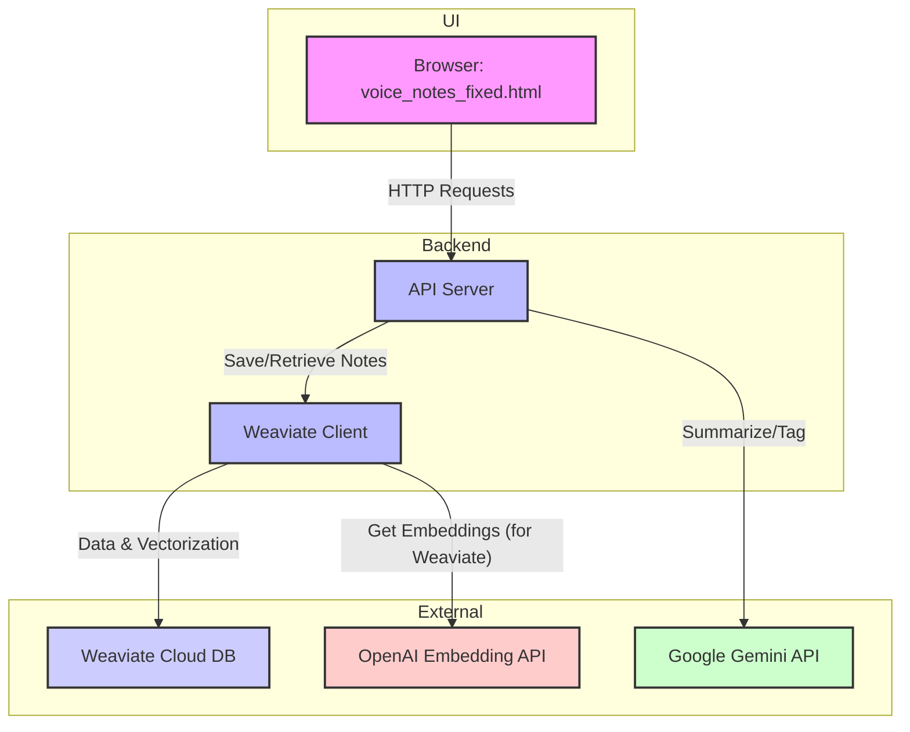
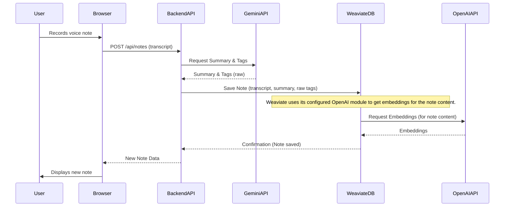

# Second Brain - Voice Note-Taking App

A full-stack voice note-taking application that allows users to record their voice and get real-time transcription in the browser, with automatic saving to a vector database.

## Current System Design

### Frontend (voice_notes_fixed.html)
The frontend is a single HTML file (`voice_notes_fixed.html`) that directly integrates:
-   **HTML**: For structure and content.
-   **CSS**: For styling, including **mobile optimization** and a **dark mode** theme.
-   **JavaScript**: For all interactive logic, including:
    -   **Web Speech API**: For real-time voice recording and continuous transcription.
    -   **Editable Transcription Area**: Users can directly edit the transcribed text.
    -   **Save & Discard Buttons**: Functionality to save the current note or clear the transcription.
    -   **Inline Tag Editing**: Users can directly edit tags on saved notes.
    -   **Backend Interaction**: Direct `fetch` API calls to the Node.js backend for saving notes, performing RAG queries, and updating notes.

### Backend (apps/api)
-   **Node.js with Express.js and TypeScript**: Handles API requests.
-   **Weaviate (Vector Database)**: Stores notes and their vector embeddings.
-   **Google Gemini API**: Used for generating summaries and initial tags for notes.
-   **OpenAI API**: Used by Weaviate for generating vector embeddings for notes (via the `text2vec-openai` module).

## Tech Stack

-   **Frontend**: HTML, CSS, JavaScript (directly in `voice_notes_fixed.html`)
-   **Backend**: Node.js with Express.js and TypeScript
-   **Database**: Weaviate (Vector Database)
-   **AI/LLM**:
    -   Google Gemini API (for summarization and initial tag generation)
    -   OpenAI API (for vector embeddings via Weaviate)
-   **Package Manager**: pnpm (Monorepo with workspaces)

    -   OpenAI API (for vector embeddings via Weaviate)
-   **Package Manager**: pnpm (Monorepo with workspaces)

## Architecture Diagram



## Interaction Diagram (Saving a Note)



## Project Structure

```
SecondBrainApp/
├── apps/
│   └── api/                # Express.js backend
│       └── src/
│           ├── middleware/ # Express middleware
│           ├── routes/     # API routes
│           └── setup.ts    # Weaviate schema setup
├── voice_notes_fixed.html  # Main frontend file
├── package.json            # Root package.json
└── pnpm-workspace.yaml     # pnpm workspace config
```

## Prerequisites

-   Node.js 18+ and pnpm
-   Weaviate instance (cloud or local)
-   Google Gemini API Key

## Setup Instructions

### 1. Clone and Install Dependencies

```bash
git clone <repository-url>
cd SecondBrainApp
pnpm install
```

### 2. Environment Configuration

#### Backend (apps/api)
Copy `apps/api/env.example` to `apps/api/.env` and fill in:

```env
# Server Configuration
PORT=7000
FRONTEND_URL=http://localhost:7001 # Note: This is currently not strictly used by voice_notes_fixed.html
GEMINI_API_KEY=your_gemini_api_key

# Weaviate Database
WEAVIATE_URL=https://your-weaviate-instance.weaviate.network
WEAVIATE_API_KEY=your_weaviate_api_key
```

### 3. Setup Weaviate Schema

```bash
cd apps/api
pnpm setup
```

This will create the necessary `Note` class in your Weaviate instance.

### 4. Start Development Servers

```bash
# From the root directory
pnpm dev
```

This will start the backend server on `http://localhost:7000`.

### 5. Access the Frontend

Open `voice_notes_fixed.html` directly in your web browser.

## Usage

1.  **Open `voice_notes_fixed.html`**: Navigate to the file in your browser.
2.  **Record Voice Notes**:
    -   Click "Start Recording" to begin voice transcription.
    -   Speak clearly into your microphone.
    -   Watch your words appear continuously in the text area.
    -   Click "Stop Recording" to finalize the note.
3.  **Edit/Save/Discard**:
    -   You can edit the transcribed text directly in the text area.
    -   Click "Save Note" to send the note to the backend.
    -   Click "Discard" to clear the text area.
4.  **View Notes**: Saved notes will appear in the right panel.
5.  **Search Notes**: Use the "Ask Your Notes" section to query your saved notes.

## API Endpoints

-   `POST /api/notes` - Create a new note
    -   Body: `{ "transcript": "string" }`
    -   Returns: Created note object

-   `GET /api/notes` - Get all notes
    -   Returns: Array of note objects sorted by creation date (newest first)

-   `GET /api/search` - Search notes using RAG
    -   Query Parameter: `query` (string)
    -   Returns: Relevant note objects

## Browser Compatibility

The speech recognition feature requires a modern browser that supports the Web Speech API:
-   Chrome/Chromium (recommended)
-   Edge
-   Safari (limited support)

## Troubleshooting

### Speech Recognition Issues
-   Ensure microphone permissions are granted.
-   Use Chrome/Chromium for best compatibility.
-   Check that HTTPS is used in production (required for microphone access).

### Backend Issues
-   Verify environment variables are correctly set.
-   Run the setup script to ensure Weaviate schema exists.
-   Check network connectivity to Weaviate instance.

## Future Enhancements / To Be Implemented

-   **Authentication**: Re-integrate user authentication (e.g., using Clerk or a custom solution) to manage user-specific notes.
-   **Improved UI/UX**: Enhance the visual design and user experience beyond the current basic HTML/CSS. Consider using a modern frontend framework (like React/Next.js) for a more structured and scalable UI.
-   **Advanced Note Management**: Implement features like editing existing notes, deleting notes, and more sophisticated filtering/sorting.
-   **Real-time Frontend Updates**: Implement WebSockets or server-sent events for real-time updates to the notes list without requiring a page refresh.
-   **Error Handling & Feedback**: Provide more robust error handling and user feedback mechanisms in the frontend.
-   **Styling**: Implement a consistent styling solution (e.g., Tailwind CSS) if a frontend framework is adopted.
-   **Testing**: Add comprehensive unit and integration tests for both frontend and backend.
-   **Deployment**: Provide instructions for deploying the application.

## Contributing

1.  Fork the repository
2.  Create a feature branch
3.  Make your changes
4.  Add tests if applicable
5.  Submit a pull request

## License

MIT License - see LICENSE file for details